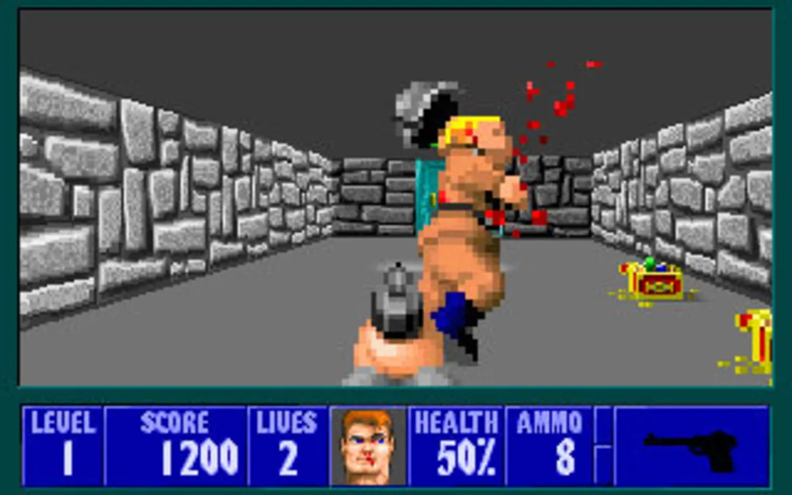
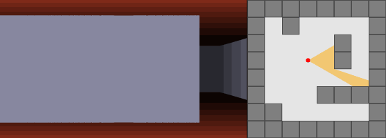
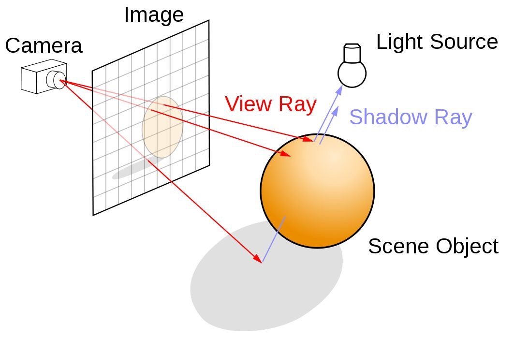
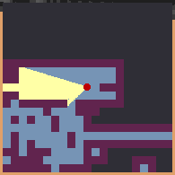
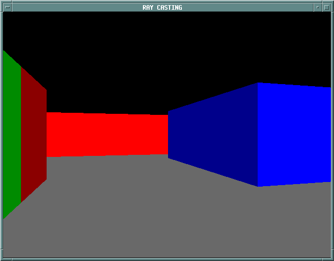
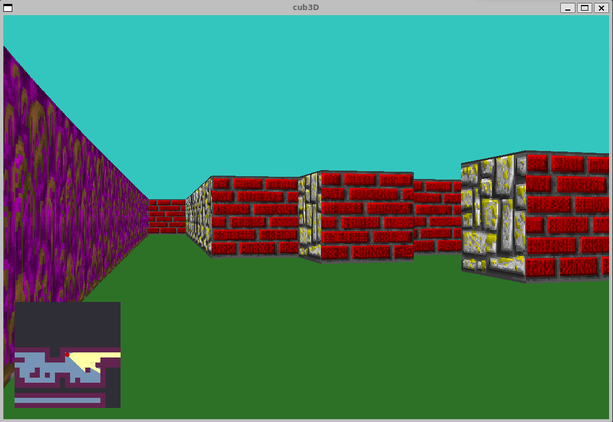

# Cub3D

### A C project that employs raycasting to emulate the gameplay of the iconic videogame [Wolfenstein 3D](https://en.wikipedia.org/wiki/Wolfenstein_3D)

 
    
     
    *Wolfenstein 3D gameplay*

## Raycasting

Raycasting refers to the use of the ray-surface intersection to solve a variety of problems in computer graphics and computational geometry.

 

 
    
     
    *Raycasting*

 

### The concept

Raycasting is the most basic of many computer graphics rendering algorithms that use the geometric [ray tracing algorithm](https://developer.nvidia.com/discover/ray-tracing). Here, the geometric rays are traced from the eye of the observator giving a first person point of view.

 

 
    
     
    *Raytracing*

 

### How to implement a basic raycasting:

The first thing you need to know is how much rays you will need to trace. In normal case you will trace one ray for each horizontal pixel your game window has. Then, if your game window has 1080 horizontal pixels you will trace 1080 rays from the position of your player.

Take a look at the next screenshot of the videogame gameplay, there, you will see a red point (the player position) and a yellow cone that represent the 1080 rays traced of the ray casting. Simplifying all this, that would be the character's range of vision.

 

 
    
     
    *Cub3D gameplay minimap*

 

At this point, you will say, 'Well, but how i trace the rays?'. The answer is very easy, you will need to understand and implement an algorithm that draw lines between two points. You can use whatever algorithm you want, in my case I decide to implement [Bresenham algorithm](https://en.wikipedia.org/wiki/Bresenham%27s_line_algorithm). The point of this algorithm is that it only uses integers, and this make the implementation quite easier :)

(Consideer take a brief look at the next image to understand how bresenham works)

 

 
    
     
    *Bresenham algorithmn*

 

Well, now you have all the rays traced and they stop when collides with a wall. The next thing you need to do is draw the walls of your 3D game. To make it 3D, draw a vertical line in your screen with the length of the ray, for example if the lentgh of the ray number 2 is 6 pixels, draw a 6 pixels vertical line in the position 2 of your horizontal window game.

 

 
    
     
    *Basic walls draw*

 

### How to execute the game:

At this moment, the game is only posible be played on linux or in a Windows Linux Subsistem (WSL).

As the game is writed in C, you will need to compile the code first. To do that, you will only need to write the next command: 

`$ make`

The game is now compiled you only need to execute it, for that execute the next command:

`$ ./cub3D maps/"The map you wanna play"`

If nothing goes wrong, you can start playing the cub3D game!

 

 
    
     
    *cub3D gameplay*

 

### More

I did this project as part of the [42 Network](https://www.42network.org/) learning route with my friend and work partner [Luis Durante](https://github.com/durantecode?tab=repositories)

If you want to now more about the game, 42 or me don't hesitate to write to me through my email, my slack or my linkedin :D

## Badges

